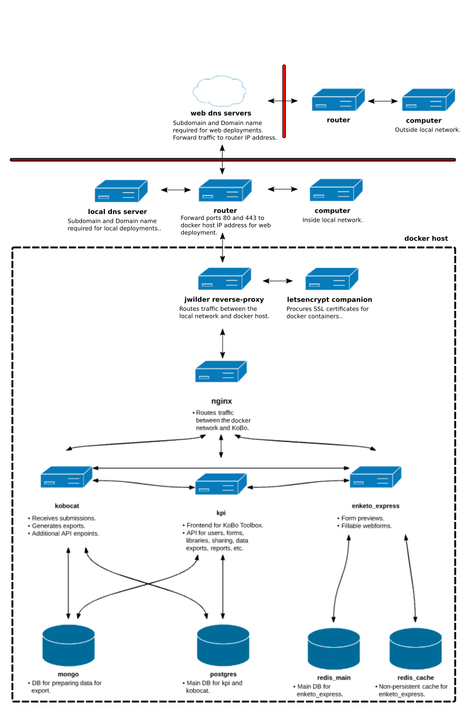

# A note of thanks and explanation:
Thank you to the developers of Kobo Toolbox for putting together a great tool. `kobo-docker-ripcord` does little more than offer an alternative and more convenient means of [KoBo Toolbox](http://www.kobotoolbox.org) deployment in network environments making use of domain names. Specifically, `kobo-docker-ripcord` is a reconfiguration of `kobo-docker` that allows for the placement of KoBo Toolbox behind [jwilder reverse proxy](https://github.com/jwilder/nginx-proxy) (reverse proxy). By doing so, a straight forward option is provided to upgrade a Kobo Toolbox deployment with automated SSL certificate support using [letsencrypt companion](https://github.com/JrCs/docker-letsencrypt-nginx-proxy-companion) (letsencrypt). As a result, **HTTPS** deployments typically done for **WEB** access are no more difficult than **HTTP** deployments typically done for **LAN** access. Additionally, running KoBo Toolbox behind `jwilder reverse proxy` allows for increased container density on the Docker host, the option to run mulitple KoBo Toolbox deployments on the same Docker host, etc.

# kobo-docker-ripcord:
`kobo-docker-ripcord` is used to run a copy of the KoBo Toolbox survey data collection platform on a machine of your choosing. It relies on [Docker](https://docker.com) to separate KoBo into different containers (which can be thought of as lighter-weight virtual machines) and [Docker Compose](https://docs.docker.com/compose/) to configure, run, and connect those containers. Below is a diagram of the containers that make up a running `kobo-docker-ripcord` system and their connections:


# Branches:
**master** -- Based on KoBo Toolbox images published in MAR2017 and is confirmed fully functional.

**latest_kobotoolbox** -- Based on latest KoBo Toolbox images. Form upload not functional on the main KoBo project page. Forms 
can be uploaded on the legacy project page. Password update not functional on the main KoBo project page. Passwords can be
updated on the KoBo admin page.

# Prerequisite Tools & Knowledge:
[ESXi](https://www.vmware.com/products/esxi-and-esx.html) -- A tested and known good Hypervisor choice.

[Ubuntu](https://www.ubuntu.com/) -- A tested and known good KoBo Toolbox server choice.

[WinSCP](https://winscp.net/eng/download.php) -- Provides a convenient way to transfer files to a remote server.

[PuTTY](http://www.putty.org/) -- Provides an [SSH](https://www.ssh.com/ssh/protocol/) interface to control a remote server.

[nano](https://www.howtogeek.com/howto/42980/the-beginners-guide-to-nano-the-linux-command-line-text-editor/) -- Linux command-line text editor which is easier to use than [Vim](https://www.linux.com/learn/vim-101-beginners-guide-vim).

[Docker Command Line Interface](https://docs.docker.com/engine/reference/commandline/cli/#description) -- Docker commands.

[Docker Compose Command Line Interface](https://docs.docker.com/compose/reference/) -- Docker Compose commands.

[GitHub Help](https://help.github.com/) -- Working with GitHub.

[Router Configuration](https://www.dd-wrt.com/wiki/index.php/Tutorials) -- DD-WRT tutorials apply to router basics in general.

[FreeDNS](http://freedns.afraid.org/) -- Bare bones but highly functional DNS provider with free domain names for testing purposes.

# A word of advice:
Correct network setup is a fundamental requirement to successfully deploy an instance of KoBo Toolbox using `kobo-docker-ripcord`. Personnel deploying KoBo Toolbox with `kobo-docker-ripcord` need a working knowledge of and access to routers and DNS mechanisms (private network DNS servers and/or public DNS providers depending on deployment type). In the case of **WEB** accessible deployments, router access is required to forward **HTTP** (port 80) and **HTTPS** (port 443) traffic to the Docker host running on the local network. In the case of both **WEB** and **LAN** accessible deployments, DNS mechanism access is required to set domain and subdomain information as well as to provide the DNS mechanism with destination information so that users can successfully browse to the KoBo Toolbox instance. For those with limited or no knowledge of routers and DNS mechanisms, it is still possible to deploy KoBo Toolbox using `kobo-docker-ripcord`. Just expect to go through all the agony and wasted time associated with learning the things a person with IT experience had to go through. The information and tools provided below should accelerate the deployment process. However, the deployment of KoBo Toolbox using `kobo-docker-ripcord` will in all liklihood not be a painless process. There are a mountain of variables and there is no practical way to cover them all. Hopefully the community can help when times are darkest.   

# Setup procedure:
Summary: A deliberate KoBo deployment is broken down into three categories. First, a server with all necessary updates is set up with [Docker Engine](https://docs.docker.com/engine/) and [Docker Compose](https://docs.docker.com/compose/). Next, proper network configuration is verfied by deploying `reverse-proxy-ripcord`. `reverse-proxy-ripcord` includes a web server to aid in network configuration verfication and troubleshooting. After network functionality is confirmed KoBo Toolbox is deployed using `kobo-docker-ripcord`.

Confirming proper network configuration can be tedious and time consuming. However, it is **absolutely** critical that the network is working properly before deploying KoBo Toolbox. If the network is not working correctly there is no chance that KoBo Toolbox will work correctly given that KoBo relies on the network to operate. DO NOT try to deploy KoBo without a known good network configuration. Fix network problems first then deploy KoBo. KoBo is too complex to use it to diagnose and correct network configuration problems. 

**Note: Command line instructions must be executed inside the directory applicable to the particular service whether it be `kobo-docker-ripcord` or `reverse-proxy-ripcord`.**

# Server Setup:
Ubuntu is used because [DigitalOcean](https://www.digitalocean.com/community/tutorials/initial-server-setup-with-ubuntu-16-04) has excellent tutorials that make configuration easy and repeatable. 

1. [Update Ubuntu Server](https://www.techonthenet.com/linux/sysadmin/ubuntu/update_16_04.php) -- Bring the server up to date.

2. [Docker Compose Installation on Ubuntu 16-04](https://www.digitalocean.com/community/tutorials/how-to-install-docker-compose-on-ubuntu-16-04) -- Make sure to complete the Prerequisites then do all the steps. Return here when complete.

3. [Disable the Ubuntu Server Firewall](https://help.ubuntu.com/community/UFW) -- Firewall is disabled to eliminate problems during deployment. **After** a fully functional KoBo deployment is made feel free to enable the firewall.

# Network Setup:
1. The first decision to make is whether your KoBo Toolbox deployment will be **HTTP** or **HTTPS** accessible. While secure communications provided by **HTTPS** are desirable, **HTTPS** is not available for **LAN** deployments based on how [letsencrypt](https://letsencrypt.org/) verifies certificates. **HTTP** deployments are suitable in cases where security threats are unlikely, such as for use strictly within a secure **LAN** network. To emphasize the difference between the two types of setup, they are referred to herein as **web** (HTTPS) and **lan** (HTTP).

2. [Clone](https://help.github.com/articles/cloning-a-repository/) the [reverse-proxy-ripcord](https://github.com/jpstaub/reverse-proxy-ripcord) repository.

3. Follow the instructions in [reverse-proxy-ripcord](https://github.com/jpstaub/reverse-proxy-ripcord) to set up a fuctional **web** or **lan** network environment. This step must be completed before moving on. KoBo requires a good network.

# KoBo Toolbox Deployment:
1. [Clone](https://help.github.com/articles/cloning-a-repository/) this repository.

2. Based on your desired instance type, create a symlink named `docker-compose.yml` to either [`docker-compose.web.yml`](./docker-compose.web.yml) or [`docker-compose.lan.yml`](./docker-compose.lan.yml) using the following as an example:

 ```$ln -s docker-compose.web.yml docker-compose.yml```

To see whether or not a symlink was created properly:
   
    $ ls -la

To remove a symlink run:
   
    $ rm docker-compose.yml
    
3. Edit the environment file [`envfile.server.txt`](./envfile.server.txt), filling in **all** mandatory variables, and optional variables as needed.    
    
4. Make the DNS system settings changes necessary to reflect the domain and subdomain settings made in `envfile.server.txt`.

5. `ping` associated Koboform, Kobocat, and Enketo Express addresses. All addresses must return a successful ping response. If
not, make adjustments to the DNS system until all pings are good. 

    $ ping kobo.example.com

6. Optionally enable additional settings for your Google Analytics token, S3 bucket, e-mail settings, etc. by editing the files in [`envfiles/`](./envfiles).

7. Start the KoBo deployment and monitor logs: 
    
 ```$ docker-compose up -d```
    
 ```$ docker-compose logs -f``` 
    
CNTRL c to escape logs
    
8. When Enketo Express has finished starting and is showing four workers ready browse to the KoBo Toolbox site. Browse to `http://{KOBOFORM_NETWORK_SUBDOMAIN}.{NETWORK_DOMAIN_NAME}`. For deployments making use of LetsEncrypt the browser should be automatically directed to the https KoBo Toolbox site.

9. To check on the status of KoBo containers:

 ```$ docker-compose ps```
    
or, to see all containers running on the Docker host:
   
    $ docker ps

10. Stop the KoBo deployment as required:

To preserve the KoBo containers for later use:
   
    $ docker-compose stop

To destroy the KoBo containers (data volumes will be retained for later use so long as the `kobo-docker-ripcord` directory persists):
   
    $ docker-compose down
    
# Backups
Automatic, periodic backups of KoBoCAT media, MongoDB, and Postgres can be individually enabled by uncommenting (and optionally customizing) the `*_BACKUP_SCHEDULE` variables in your `envfile`. When enabled, timestamped backups will be placed in `backups/kobocat`, `backups/mongo`, and `backups/postgres`, respectively. Redis backups are currently not generated, but the `redis_main` DB file is updated every 5 minutes and can always be found in `.vols/redis_main_data/`.

Backups can also be manually triggered when `kobo-docker` is running by executing the the following commands:
```
docker exec -it kobodocker_kobocat_1 /srv/src/kobocat/docker/backup_media.bash
docker exec -it kobodocker_mongo_1 /srv/backup_mongo.bash
docker exec -it kobodocker_postgres_1 /srv/backup_postgres.bash
```

# Troubleshooting

## Basic troubleshooting
1. Confirm that containers in general are running with `docker ps`. 

2. To inspect the log output from the containers, execute `docker-compose logs -f` or for a specific container use e.g. `docker-compose logs -f redis_main`. It is also worth checking the logs of the `reverse-proxy-ripcord` containers to see how the network is responding to requests. 

3. Use `ping` to confirm the addresses of Koboform, Kobocat, and Enketo Express are routing correctly. If good pings are returned the problem is likely associated with router port forwarding. If bad pings are returned the problem is likely associated with the DNS system. 

4. Double check that router port forwarding is set correctly for good pings. Double check that DNS system settings are correct for bad pings. 

5. Double check the firewall on the Docker host is disabled.

6. Any many other items associated with your given deployment. 

## Django debugging
Developers can use [PyDev](http://www.pydev.org/)'s [remote, graphical Python debugger](http://www.pydev.org/manual_adv_remote_debugger.html) to debug Python/Django code. To enable for the `kpi` container:

1. Specify the mapping(s) between target Python source/library paths on the debugging machine to the locations of those files/directories inside the container by customizing and uncommenting the `KPI_PATH_FROM_ECLIPSE_TO_PYTHON_PAIRS` variable in [`envfiles/kpi.txt`](./envfiles/kpi.txt).
2. Share the source directory of the PyDev remote debugger plugin into the container by customizing (taking care to note the actual location of the version-numbered directory) and uncommenting the relevant `volumes` entry in your `docker-compose.yml`.
3. To ensure PyDev shows you the same version of the code as is being run in the container, share your live version of any target Python source/library files/directories into the container by customizing and uncommenting the relevant `volumes` entry in your `docker-compose.yml`.
4. Start the PyDev remote debugger server and ensure that no firewall or other settings will prevent the containers from connecting to your debugging machine at the reported port.
5. Breakpoints can be inserted with e.g. `import pydevd; pydevd.settrace('${DEBUGGING_MACHINE_IP}')`.

Remote debugging in the `kobocat` container can be accomplished in a similar manner.
