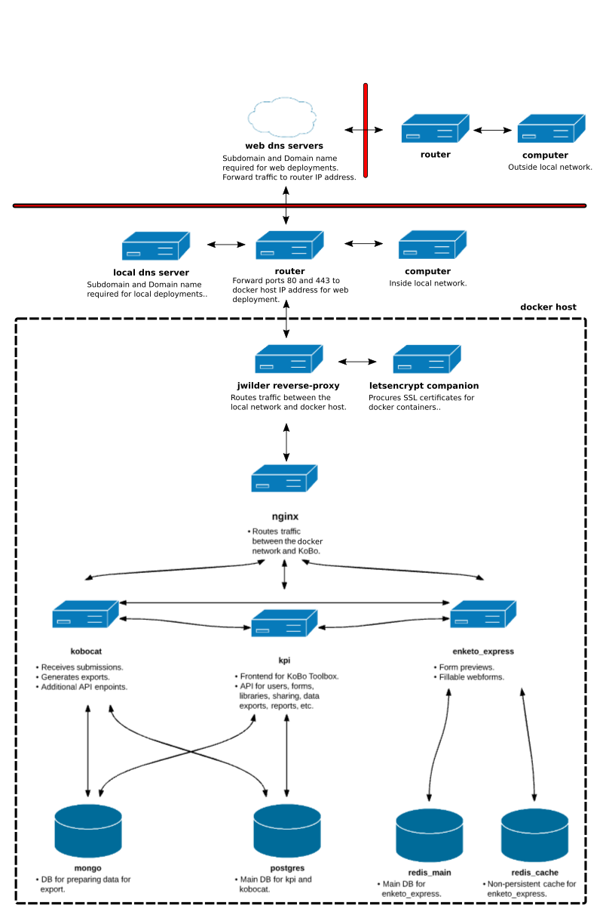

# A note of thanks and explanation:

Thank you to the developers of KoboToolbox for putting together a great tool. `kobo-docker-ripcord` does little more than offer an alternative and more convenient means of [KoBo Toolbox](http://www.kobotoolbox.org) deployment in network environments making use of domain names. Specifically, `kobo-docker-ripcord` is a reconfiguration of `kobo-docker` that allows for the placement of KoBo Toolbox behind [jwilder reverse proxy](https://github.com/jwilder/nginx-proxy) (reverse proxy). By doing so a straight forward option is provided to upgrade a Kobo Toolbox deployment with automated SSL certificate support using [letsencrypt companion](https://github.com/JrCs/docker-letsencrypt-nginx-proxy-companion) (letsencrypt). As a result, **HTTPS** deployments typically done for **WEB** access are no more difficult than **HTTP** deployments typically done for **LAN** access. Additionally, running KoBo Toolbox behind `jwilder reverse proxy` allows for increase container density on the Docker host, the option to run mulitple KoBo Toolbox deployments on the same Docker host, etc.

# kobo-docker-ripcord

`kobo-docker-ripcord` is used to run a copy of the KoBo Toolbox survey data collection platform on a machine of your choosing. It relies on [Docker](https://docker.com) to separate the different parts of KoBo into different containers (which can be thought of as lighter-weight virtual machines) and [Docker Compose](https://docs.docker.com/compose/) to configure, run, and connect those containers. Below is a diagram of the containers that make up a running `kobo-docker-ripcord` system and their connections:


# Version Control:

**Master** -- Based on KoBo Toolbox images published in MAR2017 and is confirmed fully functional.

**Latest** -- Based on latest KoBo Toolbox images. Form upload not functional on the main KoBo project page. Forms can be 
              uploaded on the legacy project page. Password update not functional on the main KoBo project page. Passwords can 
              be updated on the KoBo admin page.

# A word of advice:

Correct network setup is a fundamental requirement to successfully deploy an instance of KoBo Toolbox using `kobo-docker-ripcord`. Personnel deploying KoBo Toolbox with `kobo-docker-ripcord` need a working knowledge of and access to routers and DNS mechanisms (private network DNS servers and/or public DNS providers depending on deployment type). In the case of **WEB** accessible deployments, router access is required to forward **HTTP** (port 80) and **HTTPS** (port 443) traffic to the Docker host running on the local network. In the case of both **WEB** and **LAN** accessible deployments, DNS mechanism access is required to set domain and subdomain information as well as to provide the DNS mechanism with destination information so that users can successfully browse to the KoBo Toolbox instance. For those with limited or no knowledge of routers and DNS mechanisms, it is still possible to deploy KoBo Toolbox using `kobo-docker-ripcord`. Just expect to go through all the agony and wasted time associated with learning the things a person with IT experience had to go through. The information and tools provided below should accelerate time to successful deployment. However, the deployment of KoBo Toolbox using `kobo-docker-ripcord` will in all liklihood not be a painless process. There are a mountain of variables and there is no practical way to cover them all. Hopefully the community can help when times are darkest.   

# Setup procedure:

Summary: A deliberate KoBo deployment is broken down into three categories. First, a server with all necessary updates is set up with [Docker Engine](https://docs.docker.com/engine/) and [Docker Compose](https://docs.docker.com/compose/). Next, proper network configuration is verfied by deploying `network-ripcord`. `network-ripcord` includes a web server to aid in network configuration verfication and troubleshooting. After network functionality is confirmed KoBo Toolbox is deployed using `kobo-docker-ripcord`.    

1. The first decision to make is whether your KoBo Toolbox deployment will be **HTTP** or **HTTPS** accessible. While secure communications provided by **HTTPS** are desirable, **HTTPS** is not available for **LAN** deployments based on how [letsencrypt](https://letsencrypt.org/) verifies certificates. **HTTP** deployments are suitable in cases where security threats are unlikely, such as for use strictly within a secure **LAN** network. To emphasize the difference between the two types of setup, they are referred to herein as **web** (HTTPS) and **lan** (HTTP).

2. Clone this repository, retaining the directory name `kobo-docker`.

3. [Install Docker Compose for Linux on x86-64](https://docs.docker.com/compose/install/). Power users on Mac OS X and Windows can try [the new Docker beta for those platforms](https://blog.docker.com/2016/03/docker-for-mac-windows-beta/), but there are known issues with filesystem syncing on those platforms.

4. Decide whether you want to create an HTTP-only **local** instance of KoBo Toolbox, or a HTTPS publicly-accessible **server** instance. Local instances will use [`docker-compose.local.yml`](./docker-compose.local.yml) and [`envfile.local.txt`](./envfile.local.txt), whereas server instances will use [`docker-compose.server.yml`](./docker-compose.server.yml) and [`envfile.server.txt`](./envfile.server.txt) instead.  
**NOTE:** For server instances, **you are expected to meet the usual basic requirements of serving over HTTPS**. That is, **public (not local-only) DNS records** for the domain and subdomains as specified in [`envfile.server.txt`](./envfile.server.txt), as well as a **CA-signed (not self-signed)** wildcard (or SAN) SSL certificate+key pair valid for those subdomains, and **some basic knowledge of Nginx server administration and the use of SSL**.

5. Based on your desired instance type, create a symlink named `docker-compose.yml` to either [`docker-compose.local.yml`](./docker-compose.local.yml) or [`docker-compose.server.yml`](./docker-compose.server.yml) (e.g. `ln -s docker-compose.local.yml docker-compose.yml`). Alternatively, you can skip this step and explicitly prefix all Docker Compose commands as follows: `docker-compose -f docker-compose.local.yml ...`.

6. Pull the latest images from Docker Hub: `docker-compose pull`. **Note:** Pulling updated images doesn't remove the old ones, so if your drive is filling up, try removing outdated images with e.g. `docker rmi`.

7. Edit the appropriate environment file for your instance type, [`envfile.local.txt`](./envfile.local.txt) or [`envfile.server.txt`](./envfile.server.txt), filling in **all** mandatory variables, and optional variables as needed.

8. Optionally enable additional settings for your Google Analytics token, S3 bucket, e-mail settings, etc. by editing the files in [`envfiles/`](./envfiles).

9. **Server-only steps:**
    1. Make a `secrets` directory in the project root and copy the SSL certificate and key files to `secrets/ssl.crt` and `secrets/ssl.key` respectively. **The certificate and key are expected to use exactly these filenames and must comprise either a wildcard or SAN certificate+key pair which are valid for the domain and subdomains specified in [`envfile.server.txt`](./envfile.server.txt).**

    2. If testing on a server that is not publicly accessible at the subdomains you've specified in [`envfile.server.txt`](./envfile.server.txt), put an entry in your host machine's `/etc/hosts` file for each of the three subdomains you entered to reroute such requests to your machine's address (e.g. `192.168.1.123 kf-local.kobotoolbox.org`). Also, uncomment and customize the `extra_hosts` directives in [`docker-compose.server.yml`](./docker-compose.server.yml). This can also be necessary in situations where 
<!-- 8. Optionally stop and clear previously built `kobo-docker` containers: `docker-compose stop; docker-compose rm`. -->
<!-- 9. Optionally clear persisted files (e.g. the Postgres database) from previous runs, **taking care that you are in the `kobo-docker` directory**: `sudo rm -rf .vols/ log/`. -->

10. Build any images you've chosen to manually override: `docker-compose build`.

11. Start the server: `docker-compose up -d` (or without the `-d` option to run in the foreground).

12. Container output can be followed with `docker-compose logs -f`. For an individual container, logs can be followed by using the container name from your `docker-compose.yml` with e.g. `docker-compose logs -f enketo_express`.

"Local" setup users can now reach KoBo Toolbox at `http://${HOST_ADDRESS}:${KPI_PUBLIC_PORT}` (substituting in the values entered in [`envfile.local.txt`](./envfile.local.txt)), while "server" setups can be reached at `https://${KOBOFORM_PUBLIC_SUBDOMAIN}.${PUBLIC_DOMAIN_NAME}` (similarly substituting from [`envfile.server.txt`](./envfile.server.txt)). Be sure to periodically update your containers, especially `nginx`, for security updates by pulling new changes from this `kobo-docker` repo then running e.g. `docker-compose pull && docker-compose up -d`.

# Backups
Automatic, periodic backups of KoBoCAT media, MongoDB, and Postgres can be individually enabled by uncommenting (and optionally customizing) the `*_BACKUP_SCHEDULE` variables in your `envfile`. When enabled, timestamped backups will be placed in `backups/kobocat`, `backups/mongo`, and `backups/postgres`, respectively. Redis backups are currently not generated, but the `redis_main` DB file is updated every 5 minutes and can always be found in `.vols/redis_main_data/`.

Backups can also be manually triggered when `kobo-docker` is running by executing the the following commands:
```
docker exec -it kobodocker_kobocat_1 /srv/src/kobocat/docker/backup_media.bash
docker exec -it kobodocker_mongo_1 /srv/backup_mongo.bash
docker exec -it kobodocker_postgres_1 /srv/backup_postgres.bash
```

# Troubleshooting

## Basic troubleshooting
You can confirm that your containers are running with `docker ps`. To inspect the log output from the containers, execute `docker-compose logs -f` or for a specific container use e.g. `docker-compose logs -f redis_main`.

The documentation for Docker can be found at https://docs.docker.com.

## Django debugging
Developers can use [PyDev](http://www.pydev.org/)'s [remote, graphical Python debugger](http://www.pydev.org/manual_adv_remote_debugger.html) to debug Python/Django code. To enable for the `kpi` container:

1. Specify the mapping(s) between target Python source/library paths on the debugging machine to the locations of those files/directories inside the container by customizing and uncommenting the `KPI_PATH_FROM_ECLIPSE_TO_PYTHON_PAIRS` variable in [`envfiles/kpi.txt`](./envfiles/kpi.txt).
2. Share the source directory of the PyDev remote debugger plugin into the container by customizing (taking care to note the actual location of the version-numbered directory) and uncommenting the relevant `volumes` entry in your `docker-compose.yml`.
3. To ensure PyDev shows you the same version of the code as is being run in the container, share your live version of any target Python source/library files/directories into the container by customizing and uncommenting the relevant `volumes` entry in your `docker-compose.yml`.
4. Start the PyDev remote debugger server and ensure that no firewall or other settings will prevent the containers from connecting to your debugging machine at the reported port.
5. Breakpoints can be inserted with e.g. `import pydevd; pydevd.settrace('${DEBUGGING_MACHINE_IP}')`.

Remote debugging in the `kobocat` container can be accomplished in a similar manner.
